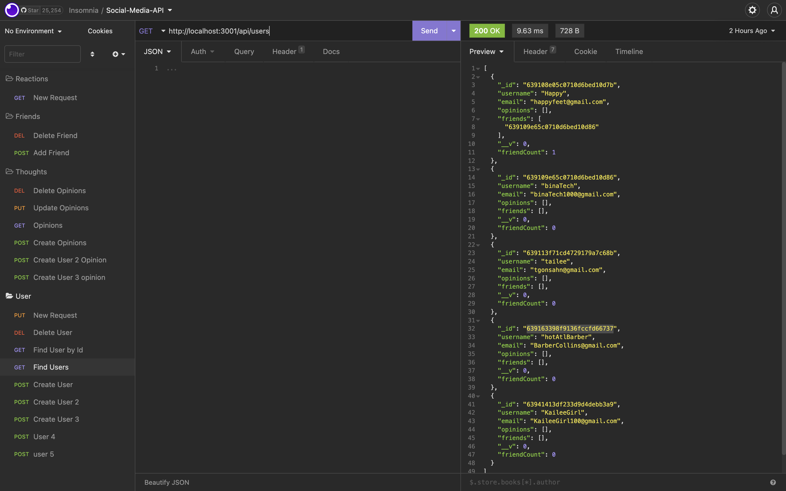

# Social-Network-API 
*  This is a social network web application, where users can share their opinions and thoughts. The users can also react to post, create and delete friends, and add and delete new users.

# Technologies 
 * "express": "^4.17.1",
 *   "moment": "^2.29.4",
 *   "mongoose": "^6.7.5"
  
  # Installation 
Clone my repository.Check the dev dependencies needed on package.json, then set up all existing packages by running npm init.

next run npm install or individually run
npm i express to install Express.js;
npm i mongoose to install Mongoose; Lastly run node server.js to open app on local host 

## Walk-through Video 
[website](https://drive.google.com/file/d/1aAifX9y5Ep_pN3kF6_VryV9HVtxPcGzw/view)

## Screenshot 

 